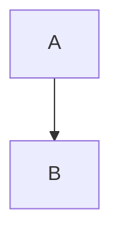

# marktextml

A small static site generator written in Rust: it turns Markdown posts — with
YAML frontmatter, GitHub-Flavored Markdown, LaTeX math and Mermaid diagrams —
into a self-contained HTML blog with a dark slate theme (left rail, sticky
topbar, drawer, footer, `#5ad1e0` accent).

Math is rendered at build time with KaTeX, so the generated pages contain no
runtime math JavaScript and work with JavaScript disabled. Only posts that
actually contain a diagram load `mermaid.min.js`.

## Requirements

- Rust 1.85+ (edition 2021)
- No other toolchain: the crate has exactly two dependencies,
  `pulldown-cmark` (Markdown) and `katex-rs` (build-time math)

## Quick start

```sh
cargo run -- build     # render content/*.md into dist/
cargo run -- serve     # preview at http://127.0.0.1:8080/
cargo run -- new my-post "My Post Title"   # scaffold content/my-post.md
```

## Commands

| Command | Effect |
|---------|--------|
| `marktextml build` | renders every file in `content/` into the output dir, copies `assets/` |
| `marktextml new <slug> [title]` | creates `content/<slug>.md` with frontmatter pre-filled (slug must match `[a-z0-9-]`) |
| `marktextml serve [--addr A:P]` | static-file HTTP preview of the built site (default `127.0.0.1:8080`) |
| `marktextml help` | usage |

## Writing a post

````markdown
---
title: Zp x Zp Field
date: 2024-01-10
slug: zp-zp-field
description: Notes on how to define the Zp x Zp field
tags: [math, abstract-algebra]
banner: assets/img/zp-zp-field.svg
---

Inline math $x^2$, display math:

$$
\forall p \in \mathbb{P},\ \mathbb{Z}_p \times \mathbb{Z}_p = \{(a,b): a,b \in \mathbb{Z}_p\}
$$


````

Frontmatter keys:

| Key | Meaning |
|-----|---------|
| `title` | post title (falls back to a title derived from the slug) |
| `date` | `YYYY-MM-DD`; rendered as "January 10, 2024" |
| `slug` | output filename: `dist/posts/<slug>.html` (defaults to the file name) |
| `description` | meta description; falls back to an excerpt of the body |
| `tags` | inline list, shown as pills in the post header |
| `banner` | optional hero image, path relative to the site root; rendered above the title |

Supported Markdown: tables, strikethrough, task lists, footnotes, heading
attributes, plus `$…$` / `$$…$$` math and ` ```mermaid ` fences.

## Configuration

Optional `site.toml` at the project root (a tiny `key = "value"` subset — no
TOML dependency). Unknown keys warn, missing keys use defaults:

```toml
title = "uidops"
description = "notes on code, math and systems"
base_url = "https://example.dev"
content = "content"
out = "dist"
templates = "templates"
assets = "assets"
```

## Layout

```
content/        Markdown sources (YAML frontmatter + body)
templates/      shell.html — the page shell, a plain {{key}} template
assets/         copied verbatim to dist/
  css/post.css  article typography, layout, banner styles
  fonts/        self-hosted Source Serif 4 (latin, latin-ext, greek)
  katex/        KaTeX stylesheet + woff/woff2 faces
  img/          banner artwork
src/
  main.rs       CLI: build / new / serve (serve is a std-only static server)
  config.rs     site.toml loader
  frontmatter.rs  YAML frontmatter splitter and parser
  markdown.rs   GFM + KaTeX + mermaid pipeline
  template.rs   {{key}} substitution (unknown key = hard error)
  site.rs       page collection, rendering, asset copy
dist/           build output (gitignored)
```

## Design notes

- **Templates** are plain `{{key}}` substitution with six keys (`title`,
  `description`, `base`, `content`, `head_extra`, `scripts_extra`). An unknown
  key fails the build rather than silently emitting `{{key}}`.
- **Math never fails a build**: KaTeX runs with `throw_on_error = false` and
  strict mode ignored, so bad LaTeX degrades to visible source instead of
  aborting.
- **Per-page CSS**: `post.css` is linked on every page but post-specific rules
  are scoped with `main:has(> .article)` so the index keeps its own layout;
  `katex.min.css` is emitted before `post.css` so theme rules win the cascade.
- **Type**: prose and math both lead with Source Serif 4 (self-hosted); glyphs
  only KaTeX carries — blackboard bold, sized delimiters, big operators — fall
  through to the KaTeX faces per glyph.
- **No entrance animations or scroll snapping**; the footer always ends the
  page because `.shell` is a column flex container.

## Testing

```sh
cargo test     # 29 tests: frontmatter, templates, markdown/math, date/excerpt
               # helpers, and an end-to-end build into a temp directory
cargo run -- build
```

`dist/` and `target/` are gitignored, as are the agent planning notes
(`task_plan.md`, `progress.md`, `findings.md`).

## License

BSD 3-Clause. See [LICENSE](LICENSE).
