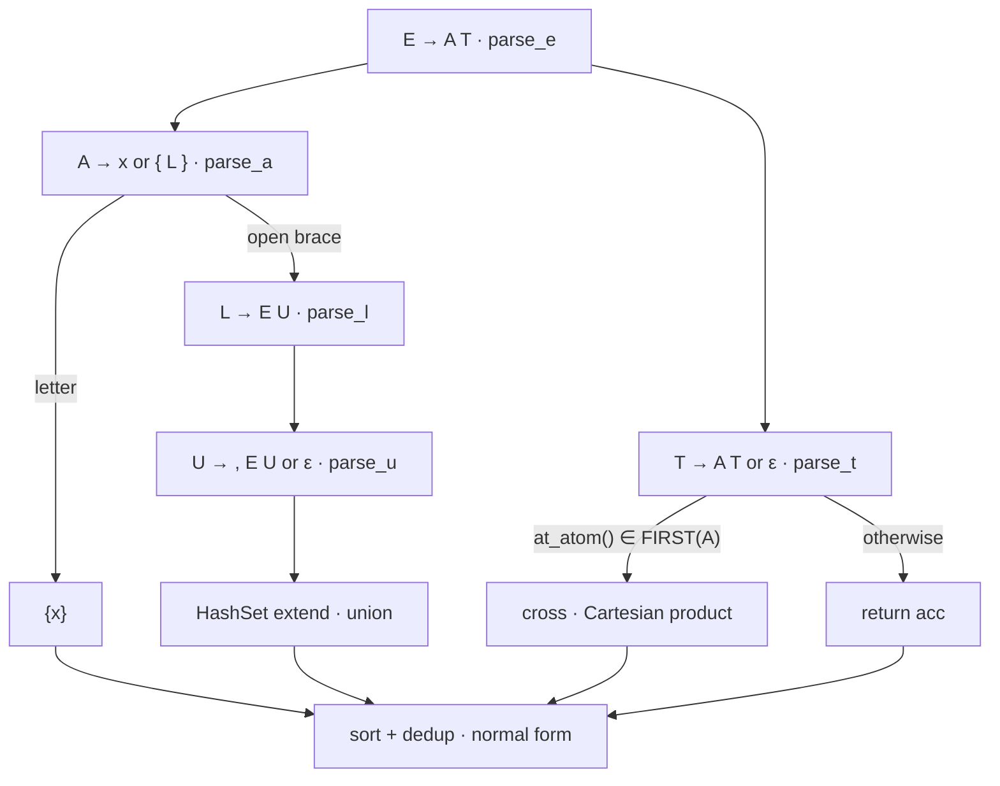

LeetCode 1096 (Hard, Weekly Contest 142) hands you a string of letters, braces
and commas and asks for *every word the string stands for*, sorted, with no
repeats. The statement gives the meaning of an expression in three rules and
then leaves you alone with them.

The solution I will explain is a recursive-descent parser in Rust: five small
functions, one per grammar production, each returning the meaning of the piece
of input it consumed. Parsing and evaluation are the same pass. The text below
reads that code through two lenses — **mathematics** (what object is being
computed, and which algebra it lives in) and **computation theory** (which
language class the input belongs to, why a single character of lookahead
suffices, and where the exponential work really hides).

## The problem

The statement defines a function $R$ from expressions to sets of words over
the lowercase alphabet $\Sigma = \{a,\dots,z\}$ with three rules:

- **letter**: $\;R(x) = \{x\}$ for every $x \in \Sigma$;
- **union**: $\;R(\{e_1,\dots,e_k\}) = R(e_1) \cup \dots \cup R(e_k)$ for
  $k \ge 2$;
- **concatenation**: $\;R(e_1e_2) = \{uv \mid u \in R(e_1),\; v \in R(e_2)\}$.

Two examples, straight from the statement:

```
"{a,b}{c,{d,e}}"          →  ["ac","ad","ae","bc","bd","be"]
"{{a,z},a{b,c},{ab,z}}"   →  ["a","ab","ac","z"]
```

Constraints: $1 \le |expression| \le 60$, characters drawn from
$\{ \texttt{\{}, \texttt{\}}, \texttt{,} \} \cup \Sigma$, and the input is
guaranteed to be well formed under the three rules. Hold on to that length
bound — section 7 leans on it heavily.

Running my crate on the two examples prints exactly those outputs, plus
`all tests passed` for the edge cases at the end of the listing
(section 9).

## 1. Two alphabets, one denotation

There are two levels here, and mixing them up is the classic source of
confusion. The **word alphabet** $\Sigma = \{a,\dots,z\}$ is what the answer
is made of. The **expression alphabet** $\Sigma_e = \Sigma \cup
\{\texttt{\{},\texttt{\}},\texttt{,}\}$ is what the input is made of. Braces
and commas live only in $\Sigma_e$; they shape how $\Sigma$-symbols combine
and never reach the output.

I will write $\llbracket e \rrbracket$ for the set of words $e$ denotes
(dropping the $R$ — same function, standard denotation brackets). Its
definition is a **structural recursion over the parse tree**, one clause per
production shape:

$$
\llbracket x \rrbracket = \{x\}, \qquad
\llbracket e_1 e_2 \rrbracket = \llbracket e_1 \rrbracket \cdot \llbracket e_2 \rrbracket, \qquad
\llbracket \{e_1,\dots,e_k\} \rrbracket = \bigcup_{i=1}^{k} \llbracket e_i \rrbracket
$$

where the concatenation of two sets is the familiar product

$$
L \cdot K = \{\, uv \mid u \in L,\; v \in K \,\}.
$$

Every recursive call is on a smaller subtree and the leaves are letters, so
the recursion is well founded — it always reaches a value.

**Claim 1.** *Every denotation is a finite, nonempty subset of* $\Sigma^+$.

*Proof.* Induction on the tree. A letter yields $\{x\}$: one word, nonempty,
of length 1. A union of finitely many nonempty finite sets is again finite
and nonempty. A product of nonempty finite sets satisfies
$|L \cdot K| \le |L| \cdot |K|$, and every word it contains is a
concatenation $uv$ with both factors nonempty, hence itself nonempty. $\square$

The proof hides the point that makes the whole problem computable: **the
syntax contains no Kleene star**, so no clause can manufacture infinitely
many words, and the product bound keeps growth finite at every node.
Enumeration of $\llbracket e \rrbracket$ is therefore an algorithm that
terminates. Section 8 returns to what happens when you add `*`.

Note also that $\varepsilon$ never appears — there is no production capable
of producing the empty word, so $\llbracket e \rrbracket \subseteq \Sigma^+$
and no special case for the empty string ever arises in the code.

## 2. The algebra behind the three clauses

Look at the three clauses again and they say: *letters map to generators,
comma-lists map to union, juxtaposition maps to product*. That is the shape
of a semiring homomorphism, and it is worth making precise because it
explains two otherwise puzzling lines in the solution (`sort` plus `dedup`).

**Definition.** An **idempotent semiring** (a *dioid*) is a structure
$(S, +, \cdot)$ where

$$
x + x = x, \qquad x(y + z) = xy + xz, \qquad 0 + x = x, \qquad 0 \cdot x = 0
$$

together with associativity of both operations, commutativity of $+$, and an
identity for $\cdot$.

**Claim 2.** *The collection of finite languages* $\mathcal{L} =
(P_{\mathrm{fin}}(\Sigma^*),\; \cup,\; \cdot,\; \emptyset,\; \{\varepsilon\})$
*is an idempotent semiring.*

*Proof.* Union of finite sets is associative, commutative and idempotent
with identity $\emptyset$ — that is exactly the algebra of a join-semilattice.
Concatenation is associative with identity $\{\varepsilon\}$. Distributivity
$L \cdot (K_1 \cup K_2) = L \cdot K_1 \cup L \cdot K_2$ holds elementwise:
$uv \in$ left iff $u \in L$ and $v \in K_1$ or $v \in K_2$, which is exactly
membership on the right. Finally $\emptyset \cdot L = \emptyset$. $\square$

**Claim 3.** $\;\llbracket\cdot\rrbracket$ *is a homomorphism of idempotent
semirings:* it sends juxtaposition to $\cdot$, comma-lists to $\cup$, and the
letter $x$ to the generator $\{x\}$.

This is literally the list of clauses from section 1, so nothing is proved
that was not already stated — the content of Claim 3 is the *bookkeeping*:
once two expressions are identified whenever the semiring laws equate them
($\{a,a\}$ and $a$, for instance), the map is the unique homomorphism
extending $x \mapsto \{x\}$. The answer the problem asks for is the image of
the input under this homomorphism, written as a sorted list of distinct
words.

Three consequences fall out, each visible as code:

| Algebraic law | What it means for the answer | Where the code does it |
|---|---|---|
| $x + x = x$ (idempotence) | repeating a word in a union changes nothing — `{ab}` written twice is one word | `HashSet` while building a brace body; `dedup()` at the very end |
| $+$ is commutative | the iteration order of a set is irrelevant, so no ordering is imposed mid-parse | order is fixed once, at the end, by `sort()` |
| $\cdot$ is **not** commutative and **not** idempotent | $\{a\}\cdot\{b\} = \{ab\} \ne \{ba\} = \{b\}\cdot\{a\}$, and products can mint duplicate words from distinct factor pairs | `cross(acc, words)` keeps its argument order fixed: left factor first |

The last row is the one that surprises people. A union can never introduce a
duplicate — that is what idempotence means — but a Cartesian product can, and
no amount of dedup *inside* the braces will see it. Section 6 shows the
collision and the one line that repairs it.

One more remark on normal forms: the problem does not ask for "any
representation" of the answer, it asks for *the sorted list of distinct
words*. Sorted-without-repeats is the canonical representative of the
equivalence class of all lists denoting the same finite set — a normal form
for $\mathcal{L}$ under lexicographic order. `sort()` then `dedup()` computes
that normal form; after it, two expressions can be compared for semantic
equality by comparing their outputs directly.

## 3. The input language: deterministic, context free, not regular

Read straight off the statement, the syntax of expressions is the obvious —
and useless — grammar:

```
E → E E | x | { L }        juxtaposition, letter, brace body
L → E | L , E              one or more comma-separated alternatives
```

It captures exactly the intended language, which is all a *recognizer*
needs, and it is exactly what a top-down parser cannot digest: `E → E E`
is left-recursive (a recursive-descent function would call itself before
consuming a single character and overflow instantly), and `L → L , E` shares
its left edge with itself for the same reason. The grammar the solution
actually implements is the left-factored, unambiguous form of the same
language:

```
E → A T            concatenation: one atom, then a tail
T → A T | ε        tail: another atom, or nothing
A → x | { L }      atom: a letter, or a braced union body
L → E U            union: one alternative, then a tail
U → , E U | ε      tail: comma plus alternative, or nothing
```

($x$ ranges over $\Sigma$; the braces are consumed by `A` itself, so `L` and
`U` never see the closing `}`.) Let $\mathcal{E}$ be the set of strings this
grammar accepts.

**Claim 4.** $\;\mathcal{E}$ *is not regular.*

*Proof sketch (pumping lemma).* Take the strings $s_d = \texttt{\{}^d\,
x\, \texttt{\}}^d$. If $\mathcal{E}$ were regular with pumping length $p$,
pick $d \ge p$; in any decomposition $s_d = uvw$ with $|uv| \le p$ and
$v \ne \varepsilon$, the pumped block $v$ lies entirely inside the leading
run of braces, so it consists of nothing but `{`. Pumping $v$ up adds opens
without matching closes: $uv^2w$ has strictly more `{` than `}`, so it is not
a well-formed expression — contradiction. $\square$

No finite automaton can match braces to unbounded depth; a machine with an
unbounded last-in-first-out store can. That is a pushdown automaton, and
Claim 4 says you need at least that much power.

**Claim 5.** $\;\mathcal{E}$ *is deterministic context free.*

The proof is the parsing table in the next section: at every step, one
peeked character uniquely selects the next production, which is exactly a
deterministic pushdown machine (read a symbol, top-of-stack nonterminal, one
transition). The recursive-descent code *is* that machine — the call stack
carries the suspended `parse_*` frames where a formal PDA would carry stack
symbols, and `peek()` is the input head. So the input language sits at
$\mathrm{LL}(1) \subset \mathrm{DCFL} \subset \mathrm{CFL}$, and the parser
matches its class: deterministic, one symbol of lookahead, no backtracking
anywhere.

## 4. FIRST, FOLLOW, and one-character decisions

Two standard sets, stated once. $\mathrm{FIRST}(X)$ is the set of terminals
that can begin some string derived from $X$; $\mathrm{FOLLOW}(X)$ is the set
of terminals that can appear immediately after something derived from $X$,
with `$` (end of input) standing for "nothing follows". For nullable
nonterminals I write $\mathrm{FIRST}(X)$ with $\varepsilon$ included.

**FIRST.** Letters and `{` start atoms; only the two tails can derive
nothing:

| Nonterminal | FIRST | Why |
|---|---|---|
| `A` | $\Sigma \cup \{\texttt{\{}\}$ | a letter or an open brace |
| `E`, `L` | $\Sigma \cup \{\texttt{\{}\}$ | both begin with `A`, resp. `E`, which begins with `A` |
| `T` | $(\Sigma \cup \{\texttt{\{}\}) \cup \{\varepsilon\}$ | one more atom, or the tail vanishes |
| `U` | $\{\texttt{,}\} \cup \{\varepsilon\}$ | another alternative, or the tail vanishes |

**FOLLOW.** Chase "who can stand after whom" from the start symbol:

| Nonterminal | FOLLOW | Where the members come from |
|---|---|---|
| `E` | `,` `}` `$` | `$` from using `E` as the whole input; `,` because `U` may follow with a comma; `}` because `U` may vanish and close the brace |
| `T` | `,` `}` `$` | `E → A T` gives `T` everything that follows `E` |
| `A` | $\Sigma \cup \{\texttt{\{},\texttt{,},\texttt{\}}, \$\}$ | `T → A T` plus `FOLLOW(T)` |
| `L` | `}` | `A → { L }` — the brace closes right after `L` |
| `U` | `}` | `L → E U` inherits `FOLLOW(L)` |

Now the LL(1) condition: for every nonterminal with competing alternatives,
the prediction sets must be disjoint.

| Nonterminal | lookahead decides | Disjointness check |
|---|---|---|
| `E`, `L` | nothing to decide — single production | — |
| **`T`** | $\Sigma \cup \{\texttt{\{}\}$ → `A T`; `,` `}` `$` → $\varepsilon$ | $\mathrm{FIRST}(A) \cap \mathrm{FOLLOW}(T) = \emptyset$ |
| **`A`** | a letter → `x`; `{` → `{ L` | letters and `{` are distinct terminals |
| **`U`** | `,` → `, E U`; `}` → $\varepsilon$ | $\{\texttt{,}\} \cap \mathrm{FOLLOW}(U) = \emptyset$ |

Every row is disjoint, so the grammar is LL(1) and each decision is a
constant-time membership test on a set of at most four symbols. Here is how
each abstract decision shows up in the Rust:

| Grammar decision | Code |
|---|---|
| the one token of lookahead | `peek()` — `None` plays the role of `$` |
| `T`'s choice: `A T` vs $\varepsilon$ | `at_atom()` — true exactly on $\mathrm{FIRST}(A)$ |
| `U`'s choice: `, E U` vs $\varepsilon$ | `self.peek() == Some(',')` |
| `A`'s choice: letter vs brace | `match self.peek() { Some('{') => … }` |
| terminal `}` of `A → { L }` | the bare `self.pos += 1` after `parse_l()` returns |

Two details deserve attention. First, that bare increment never *checks*
that the character really is `}` — it is trusted, and rightly so: the
constraints promise well-formed input, so `}` is guaranteed to sit exactly
where `FOLLOW(L)` says it does. Second, the letter arm of `parse_a` is a
catch-all (`Some(c) => …`): on raw input it would happily treat a comma as a
letter. It is safe only because every caller reaches it after predicting with
`at_atom()` or with the `'{'` match — the LL(1) guards are what make the
catch-all correct.

The loop structure also gives termination for free: every recursion is
preceded by at least one consumed character (`{` before `L`, `,` before `U`'s
tail, a letter before returning), so `pos` grows monotonically over a finite
input, and the total number of parsing decisions is $O(n)$.

## 5. Meaning computed during the parse

A conventional implementation builds a parse tree, walks it, and throws it
away. This one never materializes the tree: each `parse_*` function returns
a `Vec<String>` that *is* the denotation of the subtree it just consumed. In
attribute-grammar terms, every nonterminal carries a single **synthesized
attribute** — the finite language of its subtree — evaluated bottom-up while
the descent is still going top-down. The recursion stack is the tree,
transiently.

| Production | Code | Semantic action |
|---|---|---|
| `A → x` | `vec![c.to_string()]` | the generator $\{x\}$ |
| `A → { L }` | return `parse_l`'s value | braces only group |
| `E → A T` | head handed to `parse_t` | seed the accumulator |
| `T → A T` | `acc = cross(&acc, &words)` | product $\cdot$ |
| `T → ε` | return `acc` | product complete |
| `L → E U` | first alternative seeds the set | seed the union |
| `U → , E U` | `set.extend(alt)` | join $+$ |
| `U → ε` | return `set` | union complete |

The accumulator trick is worth naming: `T` and `U` are written as plain
loops (`parse_t(acc)`, `parse_u(&mut set)`) instead of the recursive tails
the grammar shows, because an accumulator threaded through a loop is exactly
the attribute flowing down a chain of right-recursive productions — same
semantics, constant stack depth instead of one frame per factor.



### A worked trace

Take Example 1, `"{a,b}{c,{d,e}}"`:

```
parse_e
├─ head = parse_a
│    '{' consumed → parse_l
│    ├─ first = parse_e → parse_a('a') = {a}
│    │          parse_t: ',' ∉ FIRST(A) → ε
│    ├─ parse_u: ',' consumed → parse_e = {b} → set = {a, b}
│    └─ parse_u: peek = '}' → ε      ('}' then consumed by parse_a)
├─ parse_t(acc = {a, b})
│    at_atom('{') → words = parse_a("{c,{d,e}}") = {c, d, e}
│    acc = cross(acc, words) = {ac, ad, ae, bc, bd, be}
│    at_atom: None ∉ FIRST(A) → ε
└─ sort + dedup → ["ac","ad","ae","bc","bd","be"]
```

And the same example at the denotational level, where the union idempotence
of section 2 does its quiet work — `ab` is produced by two different
alternatives, `z` by two others, and each collapses:

$$
\begin{aligned}
\llbracket \{\{a,z\},\, a\{b,c\},\, \{ab,z\}\} \rrbracket
  &= \{a,z\} \;\cup\; \{a\} \cdot \{b,c\} \;\cup\; \{ab,z\} \\
  &= \{a,z\} \;\cup\; \{ab,ac\} \;\cup\; \{ab,z\} \;=\; \{a,\, ab,\, ac,\, z\}
\end{aligned}
$$

## 6. Why the answer needs both `sort()` and `dedup()`

Claim 3's third row, made concrete. Let the expression be
`{a,ab}{bcd,cd}`. The two factors denote $\{a, ab\}$ and $\{bcd, cd\}$, and
the Cartesian product contains four ordered pairs — but two of them spell
the same word:

$$
a \cdot bcd \;=\; abcd \;=\; ab \cdot cd
$$

So `cross` builds four strings of which only three are distinct
(`abcd`, `acd`, `abbcd`). The collision happens *across* a concatenation,
between pairs drawn from different factors; the `HashSet` lives *inside*
brace bodies, so it is not in a position to see it. Only a global dedup
after all products are finished can collapse it — hence
`result.sort(); result.dedup();` in `brace_expansion_ii`, after `dedup` has
its consecutive duplicates to work on (Rust's `Vec::dedup` only removes
*adjacent* repeats, which is why the sort must come first).

With that, correctness is a short induction. **Invariant:** when a
`parse_*` call returns, the set of strings in its `Vec` equals the
denotation of the subtree it consumed. The inductive steps are the semantic
action table of section 5 — `vec![c]` is $\{x\}$, `cross` satisfies
$\mathrm{set}(\mathrm{cross}(A,B)) = A \cdot B$ by construction, `extend` is
$\cup$. Delimiters are never swallowed into an atom because `parse_t` stops
on everything in `FOLLOW(T)` and `parse_u` stops on `}` — none of them can
start an atom. Termination was settled in section 4. The final sort+dedup
then turns the invariant's *set* into the canonical list the statement
demands.

## 7. Complexity: where the exponentials live

Write $n = |expression| \le 60$, $N = |\llbracket e \rrbracket|$ (answer
size) and $W = \sum_{w} |w|$ (all characters of the answer).

**Parsing is $O(n)$.** `pos` advances exactly once per character, each peek
is constant time, and every loop iteration consumes at least one character.

**The output itself is exponential in $n$, unavoidably.** Take $k$ copies of
`{a,b}`: the input has $5k$ characters and the answer has $2^k =
2^{n/5}$ words. Any algorithm must write $N$ words, so no solution can be
polynomial in $n$ alone — the honest formulation is *output-polynomial*:
polynomial in $n + W$. The judge's bound $n \le 60$ keeps this theoretical:
the most product-shaped input I could construct packs factors whose
per-character word yield is best at three- and four-letter unions, and even
filling all 60 characters with them (six `{a,b,c}` and two `{a,b,c,d}`
factors, exactly 60 characters) yields $3^6 \cdot 4^2 = 11664$ words of
length 8 — a few tens of kilobytes, trivial to sort.

**Sorting is $O(N \log N)$ comparisons**, each touching $O(\bar{L})$
characters, i.e. $O(W \log N)$ over the answer.

**The subtlety: intermediate results are not deduplicated.** `parse_t`
multiplies `acc` by each factor's set and keeps the raw product. Consider
$k$ copies of `{x,xx}` ($6k$ characters). After $t$ factors the accumulator
holds $2^t$ strings even though only $t+1$ of them are distinct (the
exponents run from $t$ to $2t$), so the accumulated string-building work is
$\Theta(2^k)$ — exponential in $n = 6k$ — while the final answer has
$N = k+1$ words and $W = \Theta(k^2)$ characters. With the judge's $n \le
60$ that is at most $2^{10} = 1024$ strings, so nothing suffers in practice;
as a statement about the algorithm, though, the code's running time is not
bounded by the size of its output.

It is a one-line repair, and the reason it works is a small lemma:

**Lemma.** *For any subexpression $g$ of $e$, $|\llbracket g \rrbracket|
\le N$.*

*Proof.* Write $e = C[g]$ for its context and pick any words $u$ from the
left surroundings and $v$ from the right ones (Claim 1 guarantees every
sibling and ancestor set is nonempty). Then
$\llbracket e \rrbracket \supseteq \{ \, u w v \mid w \in \llbracket g
\rrbracket \, \}$, and concatenating fixed strings is injective, so
$|\llbracket g \rrbracket| \le |\llbracket e \rrbracket| = N$. $\square$

If dedup ran after *every* `cross`, each live accumulator would be a
duplicate-free set, hence bounded by the lemma, as would each factor's set.
Each factor step then costs at most $N \cdot N$ pair constructions, over at
most $n$ factors: $O(n N^2 \bar{L})$ — polynomial in the output, genuinely
output-sensitive. The `HashSet` inside braces already implements exactly
this idea for unions; `parse_t` is the one place it is missing.

| Phase | Cost in this code | Note |
|---|---|---|
| parsing decisions | $O(n)$ | one pass, one token of lookahead, no backtracking |
| brace unions | absorbed by `HashSet` | deduplicated at every brace |
| concatenation | up to $\Theta(2^{n/6})$ built strings | no dedup between factors — see above |
| sorting | $O(W \log N)$ | dominates when the answer is large |
| space | answer plus live accumulators | $\Omega(W)$ anyway: the answer must be returned |

## 8. What changes if the language grows

Three variants, seen from the same two lenses:

- **Add Kleene star.** The semiring of section 2 gains a star operation
  (least solution of $X = aX + 1$), and now $\llbracket e^* \rrbracket$ may
  be infinite — enumeration stops being an algorithm, because an algorithm
  must halt on every input. Decision problems survive but change weight:
  equivalence of full regular expressions (union, concatenation, star) is
  decidable yet PSPACE-complete (Meyer–Stockmeyer), whereas in the starless
  fragment here it degenerates to comparing two explicit sorted lists, since
  both denotations are finite.
- **Count instead of list.** You cannot compute $N$ by multiplying branch
  sizes: collisions (section 6) and words shared between branches both break
  the product rule. Deduplication is not cosmetic — it is what makes the
  count well defined.
- **Widen the alphabet or add a fourth operator.** Nothing structural
  changes: the alphabet size is a parameter of $\Sigma$, and a new operator
  is one new production plus one new semantic clause — PROVIDED it still maps
  to an operation on finite sets. Star is the boundary because it does not.

There is also a pleasant completeness fact in the other direction: the
starless expressions denote *exactly* the finite languages. Finiteness is
Claim 1; conversely any finite set $\{w_1,\dots,w_N\}$ is denoted by the
union of its words spelled out letter by letter. So $\llbracket\cdot\rrbracket$
is onto $P_{\mathrm{fin}}(\Sigma^*)$ — injective it is not, and the gap
between distinct expressions with the same denotation is precisely the
semiring laws of Claim 3.

## 9. The solution

The complete crate — parser, helpers, and the assertions I ran to verify the
examples above:

```rust
use std::collections::HashSet;
struct Solution;

impl Solution {
    pub fn brace_expansion_ii(expression: String) -> Vec<String> {
        let chars: Vec<char> = expression.chars().collect();
        let mut p = Parser { chars, pos: 0 };
        let mut result = p.parse_e();
        result.sort();
        result.dedup();
        result
    }
}

struct Parser {
    chars: Vec<char>,
    pos: usize,
}

impl Parser {
    // lookahead
    fn peek(&self) -> Option<char> {
        self.chars.get(self.pos).copied()
    }

    fn at_atom(&self) -> bool {
        matches!(self.peek(), Some(c) if c.is_ascii_lowercase() || c == '{')
    }

    fn parse_e(&mut self) -> Vec<String> {
        let head = self.parse_a();
        self.parse_t(head)
    }

    fn parse_t(&mut self, mut acc: Vec<String>) -> Vec<String> {
        while self.at_atom() {
            let words = self.parse_a();
            acc = cross(&acc, &words);
        }
        acc
    }

    fn parse_a(&mut self) -> Vec<String> {
        match self.peek() {
            Some('{') => {
                self.pos += 1;
                let set = self.parse_l();
                self.pos += 1;
                set
            }
            Some(c) => {
                self.pos += 1;
                vec![c.to_string()]
            }
            None => unreachable!("unexpected end of input"),
        }
    }

    fn parse_l(&mut self) -> Vec<String> {
        let first = self.parse_e();
        let mut set: HashSet<String> = first.into_iter().collect(); // union so far
        self.parse_u(&mut set);
        set.into_iter().collect()
    }

    fn parse_u(&mut self, set: &mut HashSet<String>) {
        if self.peek() == Some(',') {
            self.pos += 1;
            let alt = self.parse_e();
            set.extend(alt);
            self.parse_u(set);
        }
    }
}

fn cross(acc: &[String], words: &[String]) -> Vec<String> {
    let mut out = Vec::with_capacity(acc.len() * words.len());
    for a in acc {
        for w in words {
            out.push(format!("{}{}", a, w));
        }
    }
    out
}

fn main() {
    // Example 1
    let e1 = Solution::brace_expansion_ii("{a,b}{c,{d,e}}".to_string());
    println!("Example 1: {:?}", e1);
    assert_eq!(e1, vec!["ac", "ad", "ae", "bc", "bd", "be"]);

    // Example 2
    let e2 = Solution::brace_expansion_ii("{{a,z},a{b,c},{ab,z}}".to_string());
    println!("Example 2: {:?}", e2);
    assert_eq!(e2, vec!["a", "ab", "ac", "z"]);

    // Edge cases
    assert_eq!(Solution::brace_expansion_ii("a".to_string()), vec!["a"]);
    assert_eq!(
        Solution::brace_expansion_ii("{a,b}".to_string()),
        vec!["a", "b"]
    );
    assert_eq!(Solution::brace_expansion_ii("ab".to_string()), vec!["ab"]);
    assert_eq!(
        Solution::brace_expansion_ii("{a,ab}{bc,c}".to_string()),
        vec!["abbc", "abc", "ac"] // a*bc = ab*c collides; all 3 words are real
    );
    assert_eq!(
        Solution::brace_expansion_ii("{a,{b,{c,d}}}".to_string()),
        vec!["a", "b", "c", "d"] // deep nesting
    );

    println!("all tests passed");
}
```

## 10. Theory against code, in one glance

| The claim from the theory | The line that keeps it |
|---|---|
| one token of lookahead decides every step (Claim 5) | `peek()` |
| $\mathrm{FIRST}(A)$ picks the `T` production | `at_atom()` |
| `,` vs $\mathrm{FOLLOW}(U)$ picks the `U` production | `self.peek() == Some(',')` |
| denotation of a letter is a generator | `vec![c.to_string()]` |
| concatenation is a set product (Claim 3) | `cross(&acc, &words)` |
| union is an idempotent join (Claim 2) | `HashSet` + `extend` |
| recursion terminates: `pos` grows before recursing | `self.pos += 1` at each terminal |
| the answer is a normal form of the denotation | `sort()` then `dedup()` |

The three grammar rules are three operations — *singleton*, *product*,
*join* — and the parser evaluates them as it recognizes them. That is the
whole trick: the mathematics of section 1 is not applied to the parse tree
afterward, it *is* the return type of every function in section 9.
